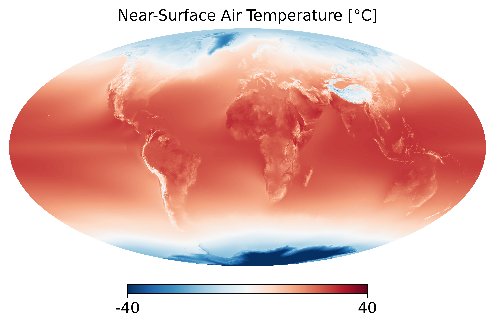

# Summary

High-resolution climate data is crucial for studying regional climate impacts and extremes, especially in topographically complex regions like Austria [@https://doi.org/10.1029/2024GL113937]. However, users often face barriers when trying to access and process datasets from multiple sources, as they differ in terms of data structure, resolution, grid structure, and naming conventions. **ClimXtract** is a modular Python toolkit developed to address this challenge. It provides standardized functions for downloading, regridding and spatially masking multiple climate datasets into a common format compatible with the high-resolution ÖKS15 dataset [@oeks15]. This includes support for variable harmonization (e.g., for temperature and precipitation), interpolation for different grid types, and optional masking for the Austrian domain. The toolkit builds upon the libraries `xarray` [@hoyer2017xarray] and `CDO` [@schulzweida_2023_10020800], which are widely used in the climate data community, and is designed for domain scientists and non-specialists alike. Together with processed example datasets and Jupyter notebooks, ClimXtract provides the climate community with a reproducible workflow for preparing data for research and downstream applications. While originally developed with the Austrian climate community in mind, ClimXtract can equally be applied to other regions.

# Statement of Need

As the demand for high-resolution climate data has increased rapidly in recent years, so too has its availability. The sources of high-resolution data are manifold and include observations, reanalyses, as well as simulations with regional and global models. This can make working with these datasets technically challenging, as they use different file formats, spatial resolutions, coordinate systems, variable naming conventions, and physical units.

Regional climate models (RCMs) downscale coarse Global Climate Model (GCM) outputs to kilometer-scale resolutions of typically 5-10 km. While this approach improves the model agreement with observations and reanalyses, systematic biases remain, with simulations tending to be too cold, too wet and too windy [@https://doi.org/10.1029/2019JD032344]. Recently, projects such as Destination Earth and nextGEMS have begun to take an alternative approach and generate global simulations directly at kilometer-scale resolutions using state-of-the-art Earth system models like ICON and IFS, with the latter coupled to the NEMO and FESOM ocean models [@egusphere-2025-509].

For Austria, the ÖKS15 climate dataset is a national reference for climate change studies. ÖKS15 was generated by regional climate models driven by GCM simulations, followed by statistical downscaling to 1 km horizontal resolution. Matching other datasets to the ÖKS15 format and grid requires several technical steps, including for example spatial interpolation and masking to the geographic domain of Austria.

**ClimXtract** simplifies access to km-scale climate data by bridging global and regional data sources and adresses the technical challenges mentioned above by providing an easy-to-use and customizable solution that:

  - unifies access to observational, model, and reanalysis data,
  - remaps diverse spatial grids to a consistent, high-resolution target grid,
  - resolves inconsistencies in variable naming, units, and metadata, and
  - supports a reproducible and modular workflow.

# Key Features

ClimXtract provides a modular pipeline for preparing high-resolution climate datasets for regional analysis. Its three capabilities are **downloading**, **regridding**, and **masking**, all designed to support interoperability and reproducability. Although the toolkit is designed with Austria and ÖKS15 in mind, all components can be configured to work with any user-defined target grid. In this paper, we illustrate its use with the ÖKS15 dataset as the standard reference grid.

## 1. Downloading

ClimXtract includes dedicated download functions to access and retrieve data from seven major climate datasets relevant for the Austrian Domain:

| Dataset              | Type          | Spatial res. | Time res. | Coverage   | Source             |
|----------------------|---------------|--------------|-----------|------------|--------------------|
| ÖKS15                | Model         | 1 km         | daily     | Austria    | Geosphere Austria  |
| SPARTACUS            | Observational | 1 km         | daily     | Austria    | Geosphere Austria  |
| EURO-CORDEX          | Model         | 12.5 km      | daily     | Europe     | ESGF               |
| E-OBS                | Observational | 11 km        | daily     | Europe     | ECA&D              |
| DestinE Climate DT   | Model         | 5-10 km      | hourly    | Global     | DestinE Data Hub   |
| ERA5                 | Reanalysis    | 30 km        | hourly    | Global     | Copernicus CDS     |
| ERA5-Land            | Reanalysis    | 9 km         | hourly    | Global     | Copernicus CDS     |

These datasets differ in format, temporal and spatial resolution, and access method. **ClimXtract** handles this heterogeneity through automated interfaces such as *wget*, *cdsapi*, and the *ESGF PyClient*. For illustration, temperature data from the ICON model from DestinE is accessed using the *Polytope Client*, while ÖKS15 data is retrieved using *HTTP filelisting*. In both cases, these interfaces are used in the background of the `load()` function.

```python
import climxtract as cxt

# load the dataset for 'tas' variable of 'oeks15' type
t_oeks15 = cxt.load(type='oeks15', model_global='MPI-M-MPI-ESM-LR',
         model_regional='SMHI-RCA4', variable='tas', experiment='rcp45',
         ens='r1i1p1', start=None, end=None, output_path=output_path_oeks15)

# load the dataset for 'tas' variable of 'destine' type
 t_destine = cxt.load(type='destine', model_global='ICON',
           model_regional=None, variable='tas', experiment='SSP3-7.0',
           ens=None, start='20210101', end='20231231',
           output_path=output_path_destine)
```

As an example, \autoref{fig:paper_figure1} shows the global-mean surface temperature as simulated by the ICON model for the DestinE Climate DT.

{ width=65% }

## 2. Regridding

Climate datasets from different sources typically come on different horizontal grids (regular lat-lon, rotated pole, Lambert conformal, HEALPix, etc.). ClimXtract offers automated regridding  to a user-defined target grid, making it easy to harmonize inputs for multi-source analysis. In our example, we regrid to the ÖKS15 grid (Lambert conformal conic, 1 km resolution), but this can be adapted for any custom NetCDF grid file.

```python
# regrid the downloaded destine dataset using distance-weighted interpolation
t_regrid_destine = cxt.regrid(type='distance', target_file=t_oeks15[0],
            input_file=t_destine[0], output_path_regrid=output_path_regridded)
```

Supported interpolation methods include:

  - Nearest neighbor (`remapnn`) - robust for sparse or irregular grid (e.g., HEALPix)
  - Bilinear (`remapbil`) - smooth field interpolation for continuous variables
  - Conservative (`remapcon`) - preserves area-integrated quantities (e.g., precipitation and radiative fluxes)
  - Distance-weighted (`remapdis`) - smoother alternative when cell geometry is not well defined

The interpolation methods are implemented using the **CDO command-line interface** wrapped in Python. Note that this wrapper does not include the `CDO` binary itself, which must be installed separately and made available in the system environment (i.e., accessible via the system PATH). In our setup, `CDO` version 2.5.0 was installed within a conda environment. However, the wrapper is compatible with any exisitng `CDO` installation. Users specify source and target grids and can switch between interpolation methods by means of the keyword `distance` depending on the variable and use case.

## 3. Masking

After regridding, ClimXtract offers a masking functionality to apply a spatial domain mask from any target dataset. This ensures spatial consistency accross datasets, removes unwanted edge regions, and aligns the data with the target analysis domain (e.g., Austria). In our example, masking is again based on the ÖKS15 grid, which defines the Austrian domain by means of NaN values outside of Austria. The masking step is implemented using `xarray.where`, making it efficient and compatible with NetCDF workflows.

As an example, masking from the HEALPix source grid [@Górski_2005] of DestinE to the ÖKS15 target grid is done as follows:

```python
# apply the oeks15 spatial mask to the regridded destine dataset
t_mask_destine = cxt.mask(target_grid=t_oeks15[0],
         input_grid=t_regrid_destine[0], output_path_mask=output_path_masked)
```

\autoref{fig:paper_figure2} illustrates the result of regridding followed by masking.

The same workflow can be applied to any combination of source and target grids. By harmonizing spatial resolution and geographic extent, ClimXtract enables consistent comparison between different datasets. This allows the Austrian climate community to easily integrate global high-resolution model output into their workflows.


# Projects using ClimXtract

ClimXtract was developed as part of the Austrian Climate Research Programme (ACRP) project **HighResLearn**. One goal of HighResLearn is to enable the Austrian climate community to effictiently access and process high-resolution global climate model data in conjunction with national-scale reference datasets like ÖKS15. As such, the ClimXtract toolkit lays the foundation for downstream applications, including machine learrning based analysis of climate model performance on regional scales [@egusphere-egu25-6462].

# Acknowledgements

The development of ClimXtract is part of the HighResLearn project (*High-resolution machine learning for the climate community in Austria*), funded by the Austrian Climate Research Programme (ACRP) under the Austrian Climate and Energy fund. We gratefully acknowledge Geosphere Austria for providing access to the ÖKS15 and SPARTACUS dataset, and the broader climate data community for maintaining open-access resources such as EURO-CORDEX, E-OBS, ERA5, and Destination Earth.

ClimXtract builds on a number of open-source tools and lobraries, including [cdo](https://code.mpimet.mpg.de/projects/cdo/wiki/Cdo%7Brbpy%7D), [cdsapi](https://pypi.org/project/cdsapi/), [ESGF PyClient](https://esgf-pyclient.readthedocs.io/en/latest/index.html), [numpy](https://numpy.org/), [polytope-client](https://github.com/ecmwf/polytope-client), [wget](https://pypi.org/project/wget/), and [xarray](http://xarray.pydata.org/). We thank the respective developer communities for their contributions and continued maintenance. We also thank our colleagues and early users of ClimXtract for their valuable feedback and testing.

# References
